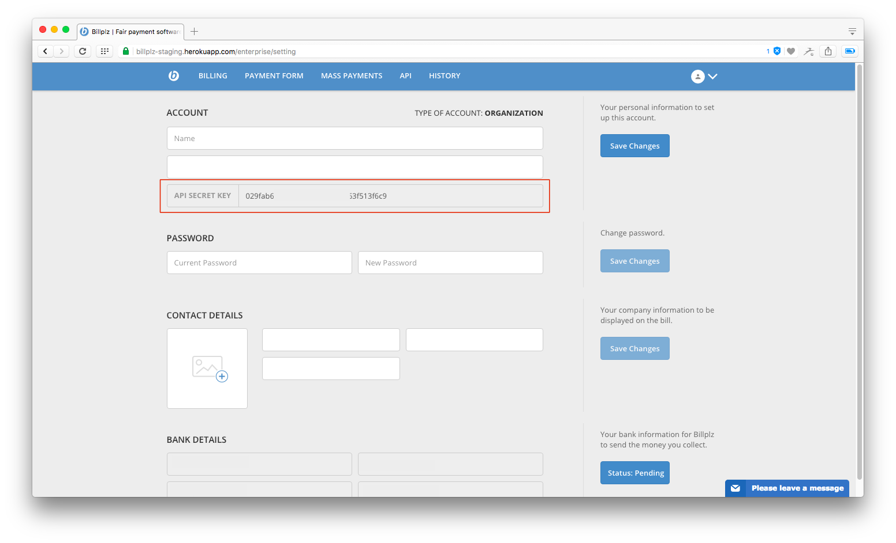

# BILLPLZ GRAPHQL SERVER

Based on [BILLPLZ v3 API](https://www.billplz.com/api#v3).

## Running the server

### 1. Install NodeJS
Make sure you have [NodeJS](https://nodejs.org/en/) installed on your machine.

### 2. Clone repo and Install Dependencies
```
git clone https://github.com/Akim95/billplz-graphql.git
npm install
```

### 3. GET a Billplz API key
* GO TO [Staging settings](https://billplz-staging.herokuapp.com/enterprise/setting) or [Production settings](https://www.billplz.com/enterprise/setting).
* Copy ```API SECRET KEY```.



### 4. SET Environment Variables:
```
// set node environment var.
export NODE_ENV="staging or production"

// set api key var.
export BILLPLZ_API_SECRET_KEY="your api secret key"
```

### 5. Run the server
```
npm start
```

##### for production
```
npm run build
```

### HOW IT WORKS?

* Open url ```http://localhost:3000/graphql```

#### Query

Get a bill:

```
{
  bill(BILL_ID: "BILL ID HERE") {
    email
    name
    amount
    description
    state
    paid
    url
  }
}
```

#### Mutation

Create a collection:

```
mutation {
  createCollection(title: "COLLECTION TITLE") {
    id
  }
}
```

Check at ```Documentation Explorer``` for more references.

## License
Billplz GraphQL Server is [GNU GPLv3 - licensed](LICENSE).
